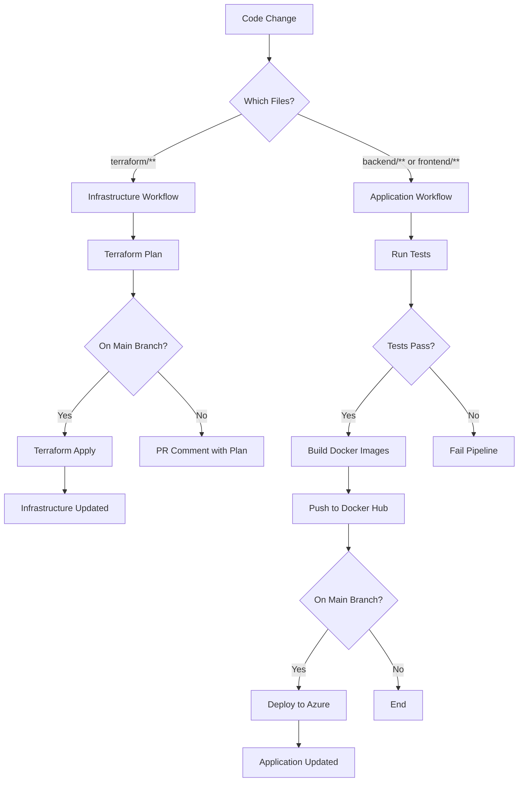

# CI/CD Setup Guide for Aloufi BurgerBuilder Project

## Overview

This project uses GitHub Actions for complete CI/CD automation, including:
- **Infrastructure as Code (IaC)** deployment with Terraform
- **Application** build, test, and deployment for frontend and backend
- Automated Docker image builds and deployments to Azure Container Apps

---

## GitHub Secrets Configuration

### Required Secrets

You need to configure the following secrets in your GitHub repository:

#### 1. Azure Credentials (for authentication)

**Secret Name:** `AZURE_CREDENTIALS`

**Value Format:** JSON containing your Azure Service Principal credentials
```json
{
  "clientId": "your-client-id",
  "clientSecret": "your-client-secret",
  "subscriptionId": "your-subscription-id",
  "tenantId": "your-tenant-id"
}
```

**How to create:**
```powershell
# Login to Azure
az login

# Create a Service Principal with Contributor role
az ad sp create-for-rbac --name "github-actions-aloufi" `
  --role contributor `
  --scopes /subscriptions/YOUR_SUBSCRIPTION_ID `
  --sdk-auth
```

Copy the entire JSON output and save it as `AZURE_CREDENTIALS` secret in GitHub.

#### 2. Docker Hub Credentials

**Secret Name:** `DOCKERHUB_USERNAME`
**Value:** `yousefaloufi6`

**Secret Name:** `DOCKERHUB_TOKEN`
**Value:** Your Docker Hub Personal Access Token

**How to create Docker Hub token:**
1. Go to Docker Hub → Account Settings → Security
2. Click "New Access Token"
3. Give it a name (e.g., "github-actions")
4. Copy the token and save it as `DOCKERHUB_TOKEN` in GitHub

---

## Workflows

### 1. Infrastructure Workflow (`infra.yml`)

**File:** `.github/workflows/infra.yml`

**Triggers:**
- Push to `main` branch (changes in `terraform/**`)
- Pull requests (changes in `terraform/**`)
- Manual dispatch with options: `plan`, `apply`, `destroy`

**Jobs:**

#### `terraform-plan`
- Validates Terraform configuration
- Runs `terraform plan`
- Comments plan output on pull requests
- Uploads plan artifact if changes detected

#### `terraform-apply`
- Runs automatically on push to `main` if changes detected
- Or manually via workflow dispatch
- Applies Terraform changes
- Auto-imports existing resources if needed
- Uploads Terraform outputs as artifacts

#### `terraform-destroy`
- Manual only (workflow dispatch with `destroy` action)
- Safely deletes Container Apps before destroying infrastructure
- Prevents subnet deletion errors

**Usage:**

```bash
# Automatic: Push Terraform changes to main
git add terraform/
git commit -m "Update infrastructure"
git push origin main

# Manual: Go to GitHub Actions → Infrastructure - Terraform → Run workflow
# Select: plan, apply, or destroy
```

### 2. Application Workflow (`app.yml`)

**File:** `.github/workflows/app.yml`

**Triggers:**
- Push to `main` or `develop` branches (changes in `backend/**` or `frontend/**`)
- Pull requests to `main` (changes in `backend/**` or `frontend/**`)
- Manual dispatch

**Jobs:**

#### `backend-test`
- Sets up JDK 21
- Runs Maven tests
- Caches Maven dependencies

#### `backend-build-push`
- Builds backend with Maven
- Creates Docker image
- Pushes to Docker Hub: `yousefaloufi6/burgerbuilder-backend:latest`
- Tags with git SHA for traceability

#### `frontend-test`
- Sets up Node.js 18
- Installs dependencies
- Runs Vitest tests
- Runs ESLint

#### `frontend-build-push`
- Builds frontend with Vite
- Creates Docker image with NGINX
- Pushes to Docker Hub: `yousefaloufi6/burgerbuilder-frontend:latest`
- Configured with API URL: `http://4.197.160.254`

#### `deploy`
- Runs after successful builds (only on `main` branch)
- Updates Container Apps with new images:
  - `ca-frontend-aloufi` in `aloufiyousef-rg`
  - `ca-backend-aloufi` in `aloufiyousef-rg`
- Verifies deployment status

**Usage:**

```bash
# Automatic: Push code changes to main
git add backend/ frontend/
git commit -m "Update application"
git push origin main

# Manual: Go to GitHub Actions → Application - Backend & Frontend → Run workflow
```

---

## CI/CD Pipeline Flow

### Complete Deployment Flow



### First-Time Setup Flow

1. **Setup GitHub Secrets** (one-time)
   - Add `AZURE_CREDENTIALS`
   - Add `DOCKERHUB_USERNAME`
   - Add `DOCKERHUB_TOKEN`

2. **Deploy Infrastructure** (first time)
   ```bash
   # Option 1: Push terraform changes
   git push origin main
   
   # Option 2: Manual workflow dispatch
   # GitHub → Actions → Infrastructure → Run workflow → Select "apply"
   ```

3. **Deploy Application** (after infrastructure exists)
   ```bash
   # Build and deploy app
   git push origin main
   ```

4. **Verify Deployment**
   ```bash
   # Check container apps
   az containerapp list --resource-group aloufiyousef-rg -o table
   
   # Check Application Gateway
   az network application-gateway show-backend-health \
     --name agw-prod \
     --resource-group aloufiyousef-rg
   ```

---

## Environment Configuration

### Current Production Environment

- **Resource Group:** `aloufiyousef-rg`
- **Region:** `australiaeast` (Australia East)
- **Application Gateway IP:** `4.197.160.254`
- **Container Apps:**
  - Frontend: `ca-frontend-aloufi`
  - Backend: `ca-backend-aloufi`
- **Docker Images:**
  - `yousefaloufi6/burgerbuilder-frontend:latest`
  - `yousefaloufi6/burgerbuilder-backend:latest`
- **Database:** 
  - Server: `sql-aloufiyousef-burgerbuilder.database.windows.net`
  - Database: `burgerbuilderaloufi`
  - User: `aloufiyousef`

### Frontend Environment Variables

Configured in `frontend/.env` and build args:
```
VITE_API_BASE_URL=http://4.197.160.254
```

### Backend Environment Variables

Configured in Terraform and Container App:
```
SERVER_PORT=8080
CORS_ALLOWED_ORIGINS=http://4.197.160.254
DB_HOST=sql-aloufiyousef-burgerbuilder.database.windows.net
DB_PORT=1433
DB_NAME=burgerbuilderaloufi
DB_USER=aloufiyousef
DB_PASSWORD=P@ssword1234!
```

---

## Monitoring and Troubleshooting

### View Workflow Runs

1. Go to GitHub repository
2. Click "Actions" tab
3. Select workflow (Infrastructure or Application)
4. Click on specific run to see logs

### Check Container App Logs

```powershell
# Frontend logs
az containerapp logs show `
  --name ca-frontend-aloufi `
  --resource-group aloufiyousef-rg `
  --follow

# Backend logs
az containerapp logs show `
  --name ca-backend-aloufi `
  --resource-group aloufiyousef-rg `
  --follow
```

### Check Deployment Status

```powershell
# Container App status
az containerapp show `
  --name ca-frontend-aloufi `
  --resource-group aloufiyousef-rg `
  --query "properties.{provisioningState:provisioningState,runningStatus:runningStatus,fqdn:configuration.ingress.fqdn}"

az containerapp show `
  --name ca-backend-aloufi `
  --resource-group aloufiyousef-rg `
  --query "properties.{provisioningState:provisioningState,runningStatus:runningStatus,fqdn:configuration.ingress.fqdn}"

# Application Gateway health
az network application-gateway show-backend-health `
  --name agw-prod `
  --resource-group aloufiyousef-rg
```

### Common Issues

#### Issue: "AZURE_CREDENTIALS secret not found"
**Solution:** Make sure you've added the `AZURE_CREDENTIALS` secret to GitHub:
1. Go to repository Settings → Secrets and variables → Actions
2. Click "New repository secret"
3. Name: `AZURE_CREDENTIALS`
4. Value: JSON output from `az ad sp create-for-rbac`

#### Issue: "DOCKERHUB_TOKEN secret not found"
**Solution:** Add Docker Hub credentials:
1. Create personal access token in Docker Hub
2. Add `DOCKERHUB_USERNAME` and `DOCKERHUB_TOKEN` secrets to GitHub

#### Issue: "Container app does not exist"
**Solution:** Deploy infrastructure first:
```bash
# Run infrastructure workflow first
# Then run application workflow
```

#### Issue: "Terraform state conflicts"
**Solution:** Import existing resources:
```bash
# The workflow automatically tries to import
# Or manually:
cd terraform/main
terraform import 'module.container_apps_env.azurerm_container_app_environment.main' \
  "/subscriptions/SUB_ID/resourceGroups/aloufiyousef-rg/providers/Microsoft.App/managedEnvironments/aloufiyousef-aca-env-prod"
```

---

## Best Practices

### Branch Strategy

1. **Feature Development:**
   ```bash
   git checkout -b feature/my-feature
   # Make changes
   git push origin feature/my-feature
   # Create PR → Tests run automatically
   ```

2. **Production Deployment:**
   ```bash
   # Merge PR to main → Deploys automatically
   git checkout main
   git merge feature/my-feature
   git push origin main
   ```

### Testing Before Deployment

- All tests must pass before deployment
- Backend: JUnit tests via Maven
- Frontend: Vitest unit tests + ESLint
- Infrastructure: Terraform validate and plan

### Manual Deployment Control

Use workflow dispatch for controlled deployments:
1. Go to GitHub Actions
2. Select workflow
3. Click "Run workflow"
4. Choose branch and options
5. Click "Run workflow" button

---

## Security Notes

### Secrets Management

- **Never commit secrets** to the repository
- Use GitHub Secrets for all sensitive data
- Rotate credentials regularly
- Use least-privilege service principals

### Database Password

Currently using fixed password: `P@ssword1234!`

**Recommended:** Use Azure Key Vault for production:
```hcl
data "azurerm_key_vault_secret" "sql_password" {
  name         = "sql-admin-password"
  key_vault_id = azurerm_key_vault.main.id
}
```

---

## Rollback Procedures

### Rollback Application

```powershell
# Rollback to previous image
az containerapp update `
  --name ca-frontend-aloufi `
  --resource-group aloufiyousef-rg `
  --image yousefaloufi6/burgerbuilder-frontend:PREVIOUS_SHA

az containerapp update `
  --name ca-backend-aloufi `
  --resource-group aloufiyousef-rg `
  --image yousefaloufi6/burgerbuilder-backend:PREVIOUS_SHA
```

### Rollback Infrastructure

```bash
# Revert Terraform changes
git revert COMMIT_SHA
git push origin main

# Or manually via workflow dispatch
# GitHub → Actions → Infrastructure → Run workflow → Select "apply"
```

---

## Additional Resources

- [GitHub Actions Documentation](https://docs.github.com/en/actions)
- [Azure Container Apps](https://learn.microsoft.com/en-us/azure/container-apps/)
- [Terraform Azure Provider](https://registry.terraform.io/providers/hashicorp/azurerm/latest/docs)
- [Docker Hub](https://hub.docker.com/)

---

## Support

For issues or questions:
1. Check GitHub Actions logs
2. Review Container App logs
3. Check Application Gateway health
4. Review this documentation
5. Check related documentation:
   - `DEPLOYMENT_COMPLETE.md`
   - `WORKFLOW_GUIDE.md`
   - `AGW_HEALTH_TROUBLESHOOTING.md`
